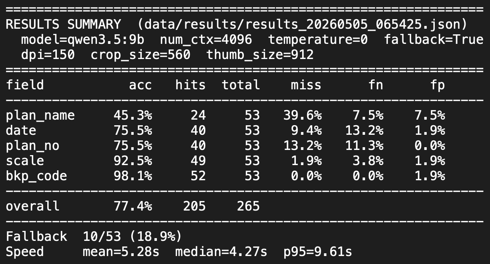

# title-block-extractor

A vision-LLM pipeline that extracts structured metadata from architectural drawing title blocks. Given a PDF, it returns the plan name, plan number, drawing date(s), scale(s), and Swiss BKP cost code(s) as a validated JSON object.

Built as a component of [Mark AI](https://marksearch.online/), a digital asset management platform for architecture offices, where it ingests legacy archives of unlabeled PDFs into a searchable index.

---

## Motivation

Architecture offices accumulate decades of CAD output as flat PDF archives with no consistent metadata. The information needed to file, search, and version these drawings is printed inside the title block — a small panel, usually bottom-right, containing the plan name, number, date, scale, and (in Switzerland) BKP cost code. Manual cataloguing does not scale; OCR and rule-based parsers fail on the variety of layouts, languages (German, French, Italian, English), and stylistic conventions used across firms.

A vision-language model can read the panel directly. The engineering question is how to make it reliable, fast, and cheap enough to run over thousands of legacy drawings on local hardware.

---

## Pipeline

```
PDF → preprocessing → crop inference → [fallback: thumbnail inference] → schema validation → JSON
```

The PDF is rasterised at 150 DPI. Two model inputs are prepared from it: a 560 px crop of the bottom-right quadrant (where the title block lives in roughly 90% of cases) and a 912 px thumbnail of the full page. The crop is sent to a local Qwen 3.5-VL model via Ollama with a constrained extraction prompt. If the result is missing the key descriptive fields (plan name, date, scale), the pipeline falls back to the thumbnail with a prompt that searches the entire drawing border. Output is parsed, normalised, and validated against a Pydantic schema before return.

---

## Module Map

| Module             | Role                                                                                                                                                                                                                                                                                              |
| ------------------ | ------------------------------------------------------------------------------------------------------------------------------------------------------------------------------------------------------------------------------------------------------------------------------------------------- |
| `preprocessing.py` | Pure functions for PDF rasterisation (PyMuPDF), aspect-preserving resize, and bottom-right cropping. Produces the two image inputs consumed by the extractor.                                                                                                                                     |
| `extractor.py`     | The extraction class. Encodes images as base64 PNG, calls Ollama's `/api/generate`, parses and validates the JSON response, and applies the crop-then-thumbnail fallback strategy. Contains the prompt templates and the Pydantic models for response validation.                                |
| `cli.py`           | Single-file entry point. `python cli.py drawing.pdf` returns a JSON object on stdout.                                                                                                                                                                                                             |
| `evaluate.py`      | Evaluation harness. Runs the extractor over a golden set, scores per-field outcomes (hit / miss / false-negative / false-positive), and prints an aggregate report including p50/p95 latency and fallback rate. Results are written as timestamped JSON for diffing across model and prompt runs. |

---

## Tests

```bash
pytest
```

Unit tests cover the deterministic parts of the pipeline:

- **Schema validators.** Parametrised tests for date normalisation (2-digit year expansion, `yyyy.mm` → `mm.yyyy` transposition, month-year vs full-date forms), scale normalisation (whitespace around colons, mixed valid/invalid lists), and BKP code grammar (1-4 digit codes with optional `.d` level-4 suffix).
- **Inference layer.** The Ollama HTTP call is mocked to verify behaviour on malformed JSON, non-object responses, markdown-fenced output, missing keys, connection errors, and timeouts. Each error path produces a diagnostic note rather than a hard failure.
- **Fallback orchestration.** The crop-then-thumbnail decision is verified independently of the inference itself, including the merge semantics (fallback fills nulls but never overwrites a successful crop extraction) and the disabled-fallback configuration.

The vision model itself is not unit-tested — model outputs are non-deterministic and are evaluated against the golden set via `evaluate.py`. This separation is intentional: the deterministic code gets fast, reproducible unit tests; the stochastic component gets a versioned evaluation harness.

---

## Design Decisions

**Local model over API.** A typical office archive holds tens of thousands of drawings. Running this on a hosted vision API raises privacy concerns for client work and adds per-call cost at archive scale. Ollama running Qwen 3.5-VL locally is free, private, and adequately fast on consumer hardware. The trade-off is sharper sensitivity to prompt and image-size choices, since the local model is smaller than frontier hosted alternatives.

**Crop-then-fallback over single full-page inference.** Sending the full drawing to the model at high resolution is slow and dilutes attention across irrelevant content (dimension lines, wall notes, hatching). Cropping the bottom-right quadrant covers the majority case quickly. The thumbnail fallback handles the long tail of layouts where the title block sits elsewhere — at the cost of a second inference call, but only when needed.

**Pydantic validation as a second line of defence.** Local vision models return malformed JSON often enough that prompt engineering alone is insufficient. The `ModelResponse` schema coerces single strings into lists, normalises Swiss-format dates (including 2-digit-year expansion and transposed `yyyy.mm` → `mm.yyyy`), normalises whitespace in scales (`1 : 50` → `1:50`), and validates BKP codes against the Swiss cost-code grammar (1–4 digit numeric, optionally `.d` for level-4). Values that fail validation are dropped silently and logged as notes, rather than poisoning the downstream index.

**Evaluation is part of the pipeline, not an afterthought.** Every change to model, prompt, image size, or DPI is evaluated against the same golden set with the same scoring function. Results are versioned alongside the code so trade-offs are visible across runs.

---

## Quick Start

### Prerequisites

- Python 3.11+
- [Ollama](https://ollama.com/) running locally with a vision model pulled (`ollama pull qwen3.5:9b`)

### Install and run

```bash
pip install -r requirements.txt
python cli.py data/examples/synthetic_drawing_01.pdf
```

Output:

```json
{
  "plan_no": "A-204.3",
  "plan_name": "Schnitt A — Längsschnitt Haus B",
  "scale": ["1:50"],
  "date": ["14.03.2024", "14.03.2024", "02.02.2024"],
  "bkp_code": ["215.4"],
  "notes": [],
  "fallback": false,
  "path": "../data/examples/synthetic_drawing_01.pdf"
}
```

### Evaluation

```bash
python evaluate.py run                       # run extractor over data/golden.json, write timestamped results
python evaluate.py summary data/results/...  # print aggregate report from a results file
```

---

## Performance

Evaluated against a hand-labelled golden set of 53 architectural PDFs from a real Swiss office archive, spanning multiple projects, decades, and title-block layouts.

| Field        | Accuracy |
| ------------ | -------- |
| `bkp_code`   | 98.1%    |
| `scale`      | 92.5%    |
| `date`       | 75.5%    |
| `plan_no`    | 75.5%    |
| `plan_name`  | 45.3%    |
| **overall**  | **77.4%** |

| Latency       | Value    |
| ------------- | -------- |
| Median        | 4.27 s   |
| p95           | 9.61 s   |
| Mean          | 5.28 s   |
| Fallback rate | 18.9%    |

<details>
  <summary>Raw evaluation output</summary>
  
</details>

Measured on Apple M4 Max with Ollama 0.23.0. Latency scales roughly with GPU memory bandwidth.

The per-field spread is the interesting story. Strictly-formatted fields (`bkp_code`, `scale`) approach ceiling because validation can verify them against a known grammar — anything malformed is dropped before it reaches the result. Date and plan number sit in the middle: well-defined formats but multiple candidates per drawing and frequent label ambiguity (a "plan number" field can hold a project number, a sheet number, or a revision tag depending on the firm). `plan_name` is the hardest field by a wide margin, because it requires the model to disambiguate the descriptive title from project names, street addresses, and firm names that share the same panel and often the same typography. Improving this field is the main open work item.

_Note: The source PDFs are not included in this repository due to client confidentiality. The golden labels (data/golden.json) and the most recent results file (data/results/) are committed so the evaluation report is reproducible from the saved artifacts, even though the extraction step cannot be re-run without the original drawings._

---

## Limitations

- **First page only.** The current pipeline processes the first page of each PDF. Multi-sheet drawing sets are out of scope but a natural extension — the preprocessing and extraction stages are page-agnostic, so adding a sheet loop and a per-sheet result aggregator would be sufficient.
- **Bottom-right heuristic.** The crop covers the common case but misses unusual layouts (title block on the left edge, top strip, or rotated). The thumbnail fallback recovers most of these but at double the latency.
- **Language coverage.** Prompts are tuned primarily for German and English title blocks. Drawings in other languages will likely degrade, particularly on label-driven fields like plan name and plan number.
- **No layout grounding.** The model is asked to identify the title block visually but is not given coordinates. Misidentification of the panel (e.g. picking up a legend block instead) is the dominant failure mode on edge cases.
